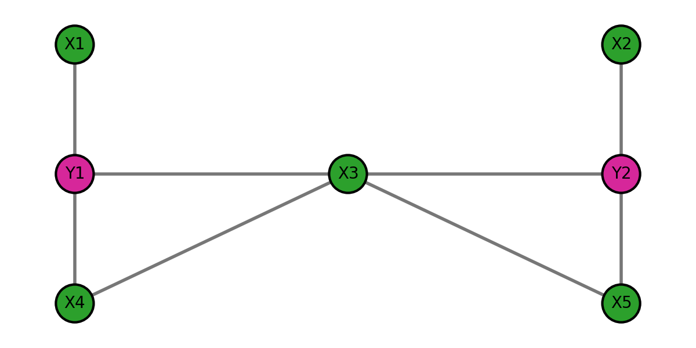

# Coordination Repeated Game (7 agents)

Tο περιβάλλον ενός **επαναληπτικού παιγνίου συντονισμού** με 7 πράκτορες, όπου σε κάθε βήμα (round) κάθε πράκτορας επιλέγει μία από 2 ενέργειες και λαμβάνει ανταμοιβή από τις αλληλεπιδράσεις του με τους γείτονές του στο γράφο.

## Πράκτορες και ενέργειες

- Υπάρχουν 7 πράκτορες δύο τύπων: **X** και **Y**.
- Κάθε πράκτορας επιλέγει μία από δύο ενέργειες: **1** ή **2**.
- Στον κώδικα οι ενέργειες κωδικοποιούνται ως:
  - `0` → ενέργεια **1**
  - `1` → ενέργεια **2**

## Γράφος επικοινωνίας / αλληλεπίδρασης

Οι ανταμοιβές προκύπτουν μόνο από αλληλεπιδράσεις πάνω στις ακμές του γράφου (undirected). Το default γράφημα υλοποιείται στο `default_adjacency_7()` και αντιστοιχεί στο παρακάτω σχήμα:

### Indexing κόμβων

`0: X1, 1: X2, 2: Y1, 3: Y2, 4: X3, 5: X4, 6: X5`

### Ακμές (undirected)

- `X1—Y1`
- `X2—Y2`
- `Y1—X3`
- `Y1—X4`
- `X3—X4`
- `X3—Y2`
- `X3—X5`
- `Y2—X5`

## Κανόνες ανταμοιβών (payoff matrices)

Για κάθε ακμή, το περιβάλλον υπολογίζει ένα ζεύγος ανταμοιβών `(row_reward, col_reward)` από ένα payoff matrix.

### X–Y αλληλεπιδράσεις (Y = row, X = col)

|        | Col: 1 | Col: 2 |
|--------|--------|--------|
| Row: 1 | (1,2)  | (1,1)  |
| Row: 2 | (1,1)  | (2,1)  |

Αυτό σημαίνει ότι:
- Ο **X** προτιμά να παίζουν και οι δύο την ενέργεια **1** (παίρνει 2 αντί για 1).
- Ο **Y** προτιμά να παίζουν και οι δύο την ενέργεια **2** (παίρνει 2 αντί για 1).

### X–X αλληλεπιδράσεις

|        | Col: 1 | Col: 2 |
|--------|--------|--------|
| Row: 1 | (2,2)  | (1,1)  |
| Row: 2 | (1,1)  | (1,1)  |

### Y–Y αλληλεπιδράσεις

|        | Col: 1 | Col: 2 |
|--------|--------|--------|
| Row: 1 | (1,1)  | (1,1)  |
| Row: 2 | (1,1)  | (2,2)  |

## Πώς υπολογίζεται το reward σε κάθε round

Στο `CoordinationGame.step(actions)`:

- Δίνεται ένα vector `actions` μήκους `n_agents` με τιμές `0` ή `1`.
- Για κάθε ακμή `(i, j)` υπολογίζεται το αντίστοιχο ζεύγος ανταμοιβών και προστίθεται στους `i` και `j`.
- Αν `aggregate="sum"` (default), επιστρέφεται το άθροισμα ανταμοιβών ανά πράκτορα.
- Αν `aggregate="mean"`, επιστρέφεται ο μέσος όρος ανά πράκτορα (διαιρώντας με το πλήθος των γειτόνων του).